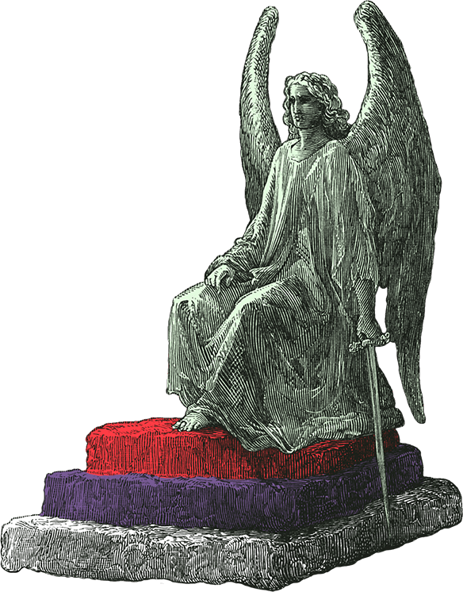

<div id="top"></div>

<!-- PROJECT LOGO -->
<br />
<div align="center">
  <a href="https://purgation-react-blog.netlify.app/">
    
  </a>

  <h3 align="center">Purgation React Blog</h3>

  <p align="center">
    A blog app project built with the MERN stack.
    <br />
    <br />
    <a href="https://purgation-react-blog.netlify.app/">Purgation React Blog (Netlify)</a>
    ·
    <a href="https://www.linkedin.com/in/andrew-j-fleming-web-dev">My LinkedIn</a>
</div>


<!-- TABLE OF CONTENTS -->
<details>
  <summary>Table of Contents</summary>
  <ol>
    <li>
      <a href="#about-the-project">About The Project</a>
      <ul>
        <li><a href="#built-with">Built With</a></li>
      </ul>
    </li>
    <li>
      <a href="#getting-started">Getting Started</a>
      <ul>
        <li><a href="#prerequisites">Prerequisites</a></li>
        <li><a href="#installation">Installation</a></li>
      </ul>
    </li>
    <li><a href="#usage">Usage</a></li>
    <li><a href="#roadmap">Roadmap</a></li>
    <li><a href="#related-projects">Related Projects</a></li>
    <li><a href="#contact">Contact</a></li>
  </ol>
</details>


<!-- ABOUT THE PROJECT -->
## About The Project

[![Project Screen Shot][project-screenshot]](https://github.com/AndrewJFleming/purgation-react-blog)

A built this app to translate some of my WordPress theme development knowledge to React.js.

It allows users to register accounts and author their own blog posts on the app. Only the authors can update or delete their respective blog posts.

Posts with truthy Featured Post values will are featured on the app's sidebar.

_A version of <a href="https://purgation-react-blog.netlify.app/">Purgation React Blog</a> is hosted on Netlify._

<p align="right">(<a href="#top">back to top</a>)</p>


### Built With

* [MongoDB](https://www.mongodb.com/)
* [Express.js](https://expressjs.com/)
* [React.js](https://reactjs.org/)
* [Node.js](https://nodejs.org/)
* [Bootstrap](https://getbootstrap.com)

<p align="right">(<a href="#top">back to top</a>)</p>


<!-- GETTING STARTED -->
## Getting Started

Below you'll find some instructions on what you'll need to run the project locally on your machine, how to install the app and how to get the app running.

### Prerequisites

* npm
  ```sh
  npm install npm@latest -g
  ```

### Installation

Before you run the client app locally, you'll need to install its required dependencies. 

1. Clone the repo
   ```sh
   git clone https://github.com/your_username_/Project-Name.git
   ```

2. Navigate to the desired directory.
   ```sh
   cd client
   ```

3. Install NPM packages
   ```sh
   npm install
   ```

4. Rename the .env.example file in the client directory to .env

<p align="right">(<a href="#top">back to top</a>)</p>


<!-- USAGE EXAMPLES -->
## Usage
The client app uses a server to interact with its MongoDB database. 

1. Start the client app locally.
   ```sh
   npm start
   ```

2. Navigate to the the server directory and start the server with the same command.
   ```sh
   npm start
   ```

<p align="right">(<a href="#top">back to top</a>)</p>


<!-- ROADMAP -->
## Roadmap

- [ ] Create admin app for create, update, delete functionality.
- [ ] Add delete account functionality for users.
- [ ] Include server directory to repo.

<p align="right">(<a href="#top">back to top</a>)</p>


<!-- RELATED PROJECTS -->
## Related Projects
Checkout my other MERN stack projects. 

1. <a href="https://github.com/AndrewJFleming/critique-me">CritiqueMe Art Critique App</a>

2. <a href="https://github.com/AndrewJFleming/embossed-react-ecommerce">Embossed React Ecommerce App</a>


<p align="right">(<a href="#top">back to top</a>)</p>


<!-- CONTACT -->
## Contact

Andrew Fleming - [My LinkedIn](https://www.linkedin.com/in/andrew-j-fleming-web-dev) - aflemi1@gmail.com

<p align="right">(<a href="#top">back to top</a>)</p>


[project-screenshot]: client/src/images/screenshot.png